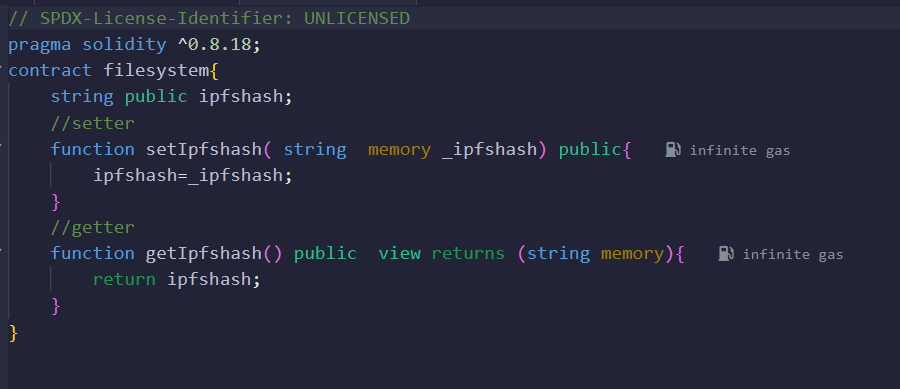
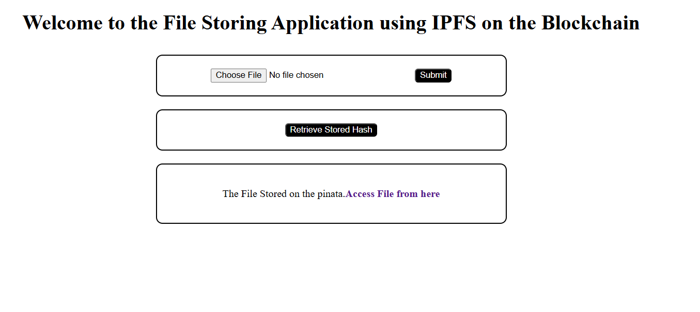
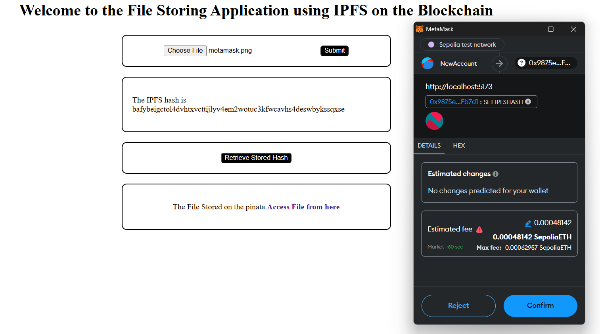
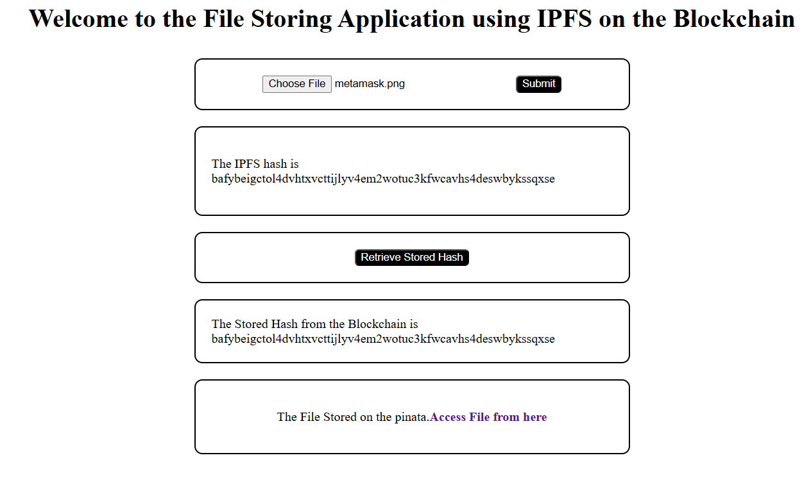
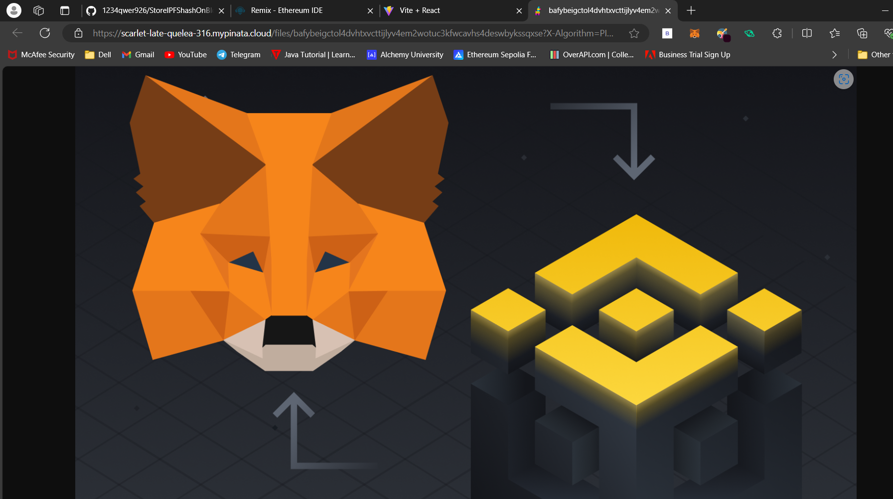

# IPFS File Storage with Blockchain Integration

This project demonstrates how to upload a file to IPFS using Pinata, store the IPFS hash on the Ethereum blockchain, and retrieve it later. The application is built using React, ethers.js, and Pinata API.

## Project Overview

This project allows users to:
- Upload files to IPFS using the Pinata API.
- Store the IPFS hash on the Ethereum blockchain for persistent and decentralized reference.
- Retrieve the stored IPFS hash from the blockchain and access the file via a signed URL.

### Key Features:
1. **IPFS File Upload**: Files are uploaded to IPFS via Pinata, and a unique IPFS hash (CID) is generated for each file.
2. **Blockchain Integration**: The IPFS hash is stored on the Ethereum blockchain using a smart contract. The application interacts with this contract to store and retrieve the hash.
3. **Pinata Signed URL**: The uploaded file can be accessed via a signed URL that expires after a set duration for added security.

## Installation

To run this application locally, follow these steps:

1. **Clone the repository**:
    ```bash
    git clone https://github.com/1234qwer926/StoreIPFShashOnBlockChain.git
    ```

2. **Navigate to the project folder**:
    ```bash
    cd StoreIPFShashOnBlockChain
    ```

3. **Install the required dependencies**:
    ```bash
    npm install
    ```

4. **Start the React application**:
    ```bash
    npm start
    ```

5. **Environment Setup**:
    Ensure that you have MetaMask installed for Ethereum account management and that you are connected to an Ethereum network (e.g., Ropsten, Rinkeby, or any private network).

## Pinata Upload & Retrieval

### Pinata File Upload Code

The function `handlesubmission` is responsible for handling the file upload. It uploads the selected file to Pinata using their API and then retrieves the IPFS hash (CID):

```js
const handlesubmission = async () => {
  const upload = await pinata.upload.file(selectedfile);
  const ipfshash = upload.cid;
  setipfshash(ipfshash);
  await storehashonblockchain(ipfshash);
};
```


# Pinata IPFS and Ethereum Blockchain Integration

This project demonstrates how to interact with Pinata for file uploads, generate signed URLs for temporary access, and store/retrieve IPFS hashes on the Ethereum blockchain using MetaMask and ethers.js.

## Project Overview

### Pinata Gateway and Signed URL

- **Upload**: Files are uploaded to IPFS using `pinata.upload.file`.
- **Signed URL**: After uploading a file, a signed URL is requested from Pinata to grant temporary access to the file for a specified duration.

Example code for generating a signed URL:
```javascript
async function main(upload) {
  const url = await pinata.gateways.createSignedURL({
    cid: upload.cid,
    expires: 1800, // Signed URL valid for 30 minutes
  });
  seturl(url);
}
```

### Blockchain Hash Storage & Retrieval

This application interacts with a smart contract on the Ethereum blockchain to store and retrieve IPFS hashes.

#### Smart Contract Functions:

1. **setIpfshash**: Stores the IPFS hash on the blockchain.
2. **getIpfshash**: Retrieves the stored IPFS hash from the blockchain.

### Storing the Hash on the Blockchain

The `storehashonblockchain` function connects to the Ethereum network using MetaMask, interacts with the smart contract, and stores the IPFS hash.

```javascript
const storehashonblockchain = async (hash) => {
  const provider = new ethers.providers.Web3Provider(window.ethereum);
  const signer = provider.getSigner();
  const contract = new ethers.Contract(contractAddress, contractAbi, signer);
  
  const tx = await contract.setIpfshash(hash);
  await tx.wait();
};
```

### Retrieving the Hash from the Blockchain

To retrieve the stored IPFS hash from the blockchain, the `retrivehashfromblockchain` function is used.

```javascript
const retrivehashfromblockchain = async () => {
  const provider = new ethers.providers.Web3Provider(window.ethereum);
  const contract = new ethers.Contract(contractAddress, contractAbi, provider);
  
  const storedhash = await contract.getIpfshash();
  setstoreshash(storedhash);
};
```

### Blockchain Connection

The application uses [ethers.js](https://docs.ethers.io/v5/) to interact with the Ethereum blockchain. MetaMask is used to request account access and sign transactions.

# IPFS File Storage with Blockchain Integration

This project demonstrates how to upload a file to IPFS using Pinata, store the IPFS hash on the Ethereum blockchain, and retrieve it later using MetaMask and ethers.js.

## 1. Smart Contract Code

The smart contract, written in Solidity, is responsible for storing and retrieving the IPFS hash on the Ethereum blockchain.

  
*Solidity code used for hash storage and retrieval.*

## 2. User Interface Page

The user interface allows users to upload a file and interact with the Ethereum blockchain.

  
*The user interface for file upload and blockchain interaction.*

## 3. Uploading File and Storing Hash in Blockchain

Once a file is uploaded to Pinata, the IPFS hash is generated. The user must then connect their MetaMask wallet to store the hash on the blockchain.

  
*Uploading the file and connecting MetaMask to store the hash on the blockchain.*

## 4. Retrieving the Hash from Blockchain

After the hash is stored, it can be retrieved from the blockchain using the smart contract.

  
*Retrieving the stored IPFS hash from the blockchain.*

## 5. Accessing the Stored File

Once the hash is retrieved, the stored file can be accessed via the signed URL provided by Pinata.

  
*Accessing the file stored on IPFS via Pinata’s signed URL.*
